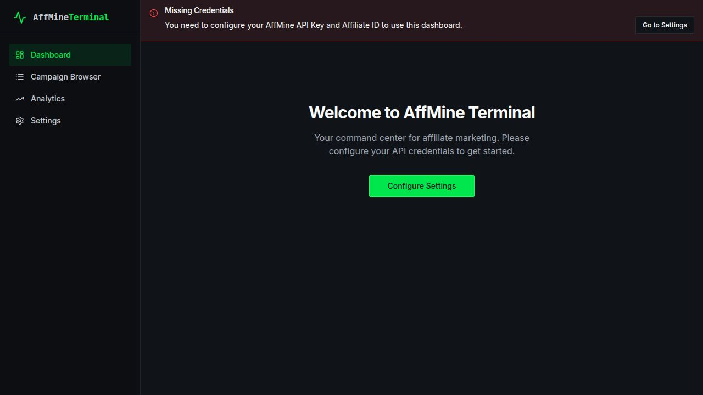
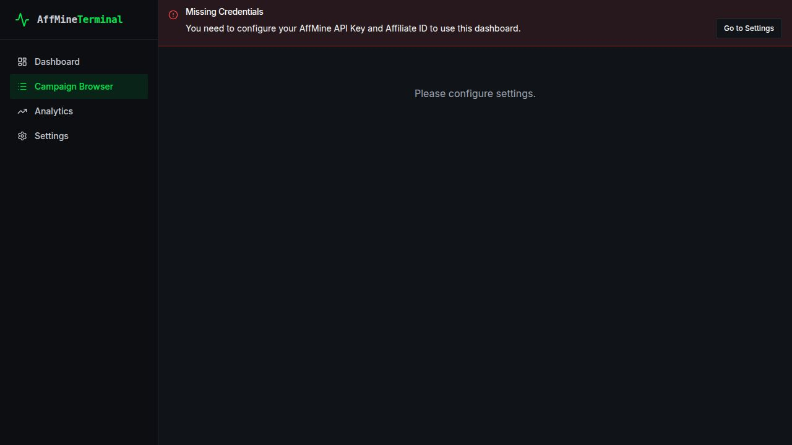
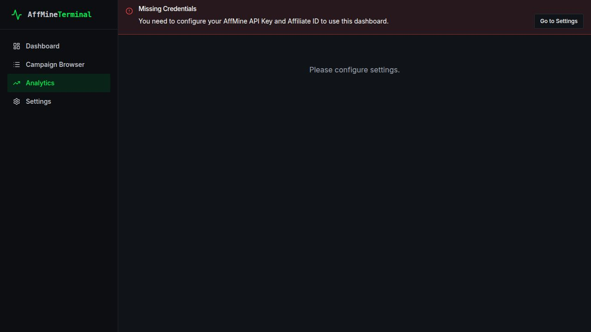
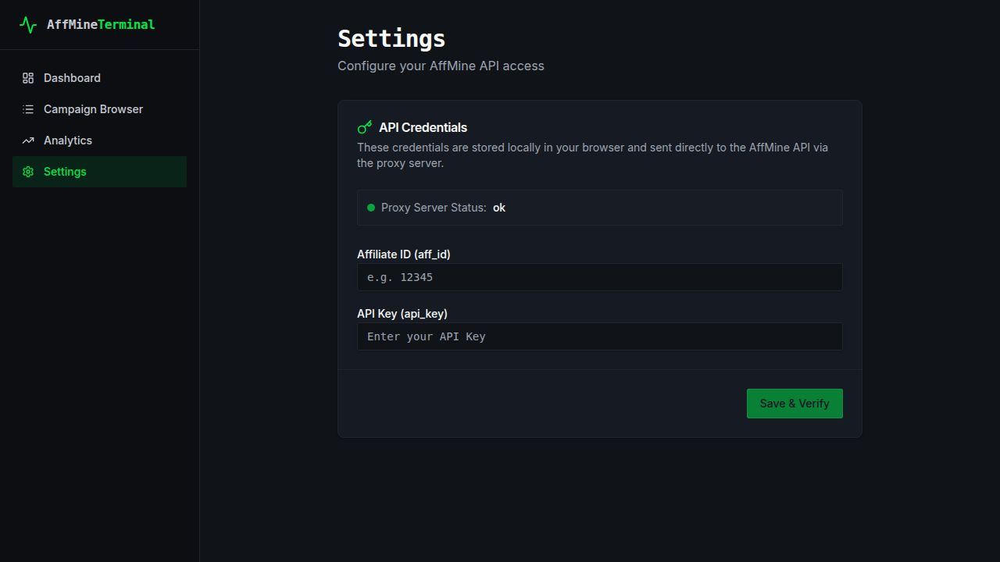

<div align="center">

# AffMine Publisher Dashboard

**A modern, full-stack affiliate marketing dashboard for the AffMine Publisher API**

Manage campaigns, analyze performance, and export data — all from a sleek dark-themed interface.

[](https://react.dev)
[](https://www.typescriptlang.org)
[](https://expressjs.com)
[](https://vitejs.dev)
[](https://tailwindcss.com)
[](https://www.docker.com)
[](https://nodejs.org)
[](https://www.postgresql.org)
[](https://pnpm.io)
[](#license)

</div>

---

## Overview

AffMine Publisher Dashboard is a full-stack web application that connects to the [AffMine affiliate network](https://www.affmine.com/r/43326) Publisher API and presents campaign data through an intuitive, real-time dashboard. Built as a **pnpm monorepo** with a React frontend and Express backend, it gives affiliate publishers the tools they need to browse campaigns, analyze performance metrics, and manage their workflow efficiently.

---

## Features

- **Real-Time Campaign Data** — Fetches live campaign data directly from the AffMine Publisher API
- **Advanced Filtering** — Filter campaigns by status, platform, category, country, and incentive type
- **Campaign Browser** — Paginated table with 20 rows per page, detail dialogs, and search
- **CSV Export** — Export all filtered campaigns to CSV with a single click
- **Analytics Dashboard** — Visual breakdowns by category, platform, country, and payout statistics
- **Dark Theme with Green Accent** — Professional UI built with Tailwind CSS and shadcn/ui
- **Local Credential Storage** — API credentials stored in browser localStorage and sent only to your proxy server
- **Docker Deployment** — One-command deployment with the included installer script
- **Type-Safe Architecture** — End-to-end TypeScript with auto-generated API clients via Orval

---

## Screenshots

| Dashboard Overview | Campaign Browser |
|:--:|:--:|
|  |  |

| Analytics & Charts | Settings |
|:--:|:--:|
|  |  |

---

## Quick Start with Docker

The fastest way to get running. Requires [Docker](https://docs.docker.com/get-docker/) and Python 3.6+.

```bash
git clone https://github.com/prohunter00017/affmine-dashboard.git
cd affmine-dashboard
python install.py
```

The installer will:

1. Detect your OS (Windows, macOS, or Linux)
2. Verify Docker and Docker Compose are installed and running
3. Scan for available ports (defaults: `3000`, `5000`, `5432`)
4. Prompt for your AffMine API credentials
5. Generate all configuration files and start the containers

Once complete, open **http://localhost:3000** in your browser.

```bash
python install.py --status   # Check container status
python install.py --stop     # Stop all containers
```

> Don't have AffMine credentials yet? [Sign up for a free AffMine publisher account](https://www.affmine.com/r/43326) to get your `aff_id` and `api_key`.

---

## Manual Development Setup

For local development without Docker.

### Prerequisites

- **Node.js** 20 or later (Node.js 24 recommended)
- **pnpm** 9 or later (`corepack enable && corepack prepare pnpm@latest --activate`)

### Installation

```bash
# Clone the repository
git clone https://github.com/prohunter00017/affmine-dashboard.git
cd affmine-dashboard

# Install all dependencies
pnpm install

# Start the API server (default port: 5000)
pnpm --filter @workspace/api-server run dev

# In a separate terminal, start the dashboard (default port: 3000)
pnpm --filter @workspace/affmine-dashboard run dev
```

Open **http://localhost:3000**, navigate to **Settings**, and enter your AffMine `aff_id` and `api_key`. Credentials are entered in-app (no `.env` file needed for local development). The dashboard will begin loading campaign data immediately.

### Useful Commands

```bash
pnpm run typecheck                              # Type-check all packages
pnpm --filter @workspace/api-server run build    # Build API server (esbuild)
pnpm --filter @workspace/affmine-dashboard run build  # Build dashboard (Vite)
pnpm --filter @workspace/api-spec run codegen    # Regenerate API client from OpenAPI spec
```

---

## Project Structure

<details>
<summary>View full directory tree</summary>

```
affmine-dashboard/
├── artifacts/
│   ├── affmine-dashboard/        # React + Vite frontend (dark theme, green accent)
│   │   └── src/
│   │       ├── pages/            # Dashboard, Campaigns, Analytics, Settings
│   │       ├── components/       # Layout, credential banner, UI components
│   │       └── hooks/            # useCredentials (cross-component reactivity)
│   └── api-server/               # Express 5 backend (API proxy)
│       └── src/
│           └── routes/           # Campaign, stats, filter-options, health endpoints
├── lib/
│   ├── api-spec/                 # OpenAPI 3.1 specification + Orval codegen config
│   ├── api-client-react/         # Auto-generated React Query hooks + fetch client
│   ├── api-zod/                  # Auto-generated Zod validation schemas
│   └── db/                       # Drizzle ORM schema + database connection
├── install.py                    # Docker installer script (cross-platform)
├── package.json                  # Monorepo root
├── pnpm-workspace.yaml           # Workspace configuration
└── tsconfig.base.json            # Shared TypeScript configuration
```

</details>

---

## Tech Stack

| Layer | Technology |
|-------|-----------|
| **Frontend** | React 19, Vite 6, Tailwind CSS 4, shadcn/ui |
| **State & Data** | React Query (TanStack Query v5), Orval-generated hooks |
| **Backend** | Express 5, Node.js 20+ |
| **Language** | TypeScript 5.9 (end-to-end) |
| **Validation** | Zod v4 (auto-generated from OpenAPI spec) |
| **API Spec** | OpenAPI 3.1 |
| **Database** | PostgreSQL 16 (via Drizzle ORM) |
| **Build** | esbuild (API server), Vite (dashboard) |
| **Monorepo** | pnpm workspaces |
| **Deployment** | Docker, Docker Compose, nginx |

---

## Dashboard Pages

<details>
<summary>View page descriptions</summary>

### Dashboard (`/`)

The overview page displays key performance indicators at a glance:

- **Total Campaigns** — Number of active campaigns available
- **Average Payout** — Mean payout across all campaigns
- **Top Category** — Most common campaign category
- **Top Platform** — Most popular target platform
- **Recent Campaigns** — Quick-access table of the latest campaigns

### Campaign Browser (`/campaigns`)

A full-featured campaign management interface:

- Filter by **status**, **platform**, **category**, **country**, and **incentive** type
- Searchable category combobox and multi-select country filter with search
- Client-side pagination with 20 campaigns per page
- Click any campaign to open a **detail dialog** with full information
- **CSV export** of all campaigns matching current filters (not just the visible page)

### Analytics (`/stats`)

Visual analytics for data-driven decisions:

- **Category bar chart** — Campaign distribution across categories
- **Platform donut chart** — Breakdown by target platform
- **Country grid** — Geographic distribution of campaigns
- **Payout statistics** — Min, max, average, and median payout cards

### Settings (`/settings`)

Credential management and system status:

- Enter and validate your AffMine `aff_id` and `api_key`
- Live validation against the AffMine API
- Proxy server health check indicator
- Credentials stored in browser localStorage

</details>

---

## API Reference

The backend exposes a RESTful API that proxies and normalizes data from the AffMine Publisher API.

<details>
<summary>View endpoint documentation</summary>

### `GET /api/healthz`

Health check endpoint for the proxy server.

**Response:** `200 OK` with `{ "status": "ok" }`

### `GET /api/campaigns`

Retrieve a list of campaigns with optional filters.

| Parameter | Type | Description |
|-----------|------|-------------|
| `aff_id` | string | **Required.** Your AffMine affiliate ID |
| `api_key` | string | **Required.** Your AffMine API key |
| `offer_status` | string | Filter by status (e.g., `active`, `paused`) |
| `platform` | string | Filter by platform (e.g., `Android`, `iOS`, `Desktop`) |
| `category` | string | Filter by campaign category |
| `countries` | string | Filter by country code(s) |
| `incentive` | string | Filter by incentive type |
| `start_row` | number | Pagination offset (default: `0`) |
| `limit_row` | number | Number of campaigns per page (default: `500`) |

### `GET /api/campaigns/stats`

Retrieve aggregated statistics across all campaigns.

| Parameter | Type | Description |
|-----------|------|-------------|
| `aff_id` | string | **Required.** Your AffMine affiliate ID |
| `api_key` | string | **Required.** Your AffMine API key |

**Response includes:** payout statistics, category breakdown, platform breakdown, country breakdown.

### `GET /api/campaigns/filter-options`

Retrieve available filter values for building the filter UI.

| Parameter | Type | Description |
|-----------|------|-------------|
| `aff_id` | string | **Required.** Your AffMine affiliate ID |
| `api_key` | string | **Required.** Your AffMine API key |

**Response includes:** list of distinct countries and categories across all campaigns.

</details>

---

## Get Your API Keys

To use the AffMine Publisher Dashboard, you need an `aff_id` and `api_key` from the AffMine affiliate network.

### How to get your credentials:

1. **[Sign up for a free AffMine publisher account](https://www.affmine.com/r/43326)**
2. Log in to the AffMine publisher portal
3. Navigate to your **account settings** or **API** section
4. Copy your **Affiliate ID** (`aff_id`) and **API Key** (`api_key`)
5. Enter them in the dashboard **Settings** page or provide them during Docker setup

> AffMine is a global affiliate network offering thousands of campaigns across mobile, desktop, and web platforms. [Join AffMine today](https://www.affmine.com/r/43326) and start monetizing your traffic.

---

## Configuration

<details>
<summary>View environment variables and storage details</summary>

### Environment Variables

When using Docker, the `install.py` script generates a `.env` file automatically:

| Variable | Description | Default |
|----------|-------------|---------|
| `DASHBOARD_PORT` | Port for the dashboard UI | `3000` |
| `API_PORT` | Port for the API server | `5000` |
| `POSTGRES_PORT` | Port for PostgreSQL | `5432` |
| `AFF_ID` | Your AffMine affiliate ID | *(prompted)* |
| `API_KEY` | Your AffMine API key | *(prompted)* |
| `DATABASE_URL` | PostgreSQL connection string | *(auto-generated)* |

### Browser Storage

In development mode (without Docker), credentials are stored in **browser localStorage**:

- `affmine_aff_id` — Your affiliate ID
- `affmine_api_key` — Your API key

These are sent only to your local proxy server, which forwards them to the official AffMine API. No third-party services receive your credentials.

</details>

---

## Contributing

Contributions are welcome! Here's how to get started:

1. **Fork** the repository
2. **Create** a feature branch (`git checkout -b feature/my-feature`)
3. **Commit** your changes (`git commit -m 'Add my feature'`)
4. **Push** to your branch (`git push origin feature/my-feature`)
5. **Open** a Pull Request

### Development Guidelines

- Run `pnpm run typecheck` before submitting — all packages must pass with zero errors
- Follow existing code style and TypeScript conventions
- Add JSDoc comments to new exported functions
- Test your changes with real AffMine API credentials when possible
- Questions? Reach out on [LinkedIn](https://www.linkedin.com/in/don7amza/)

---

## License

This project is licensed under the MIT License.

---

<div align="center">

**Built for the [AffMine](https://www.affmine.com/r/43326) publisher community**

[Get Your API Keys](https://www.affmine.com/r/43326) | [Report a Bug](https://www.linkedin.com/in/don7amza/) | [Request a Feature](https://www.linkedin.com/in/don7amza/) | [Contact](https://www.linkedin.com/in/don7amza/)

</div>
